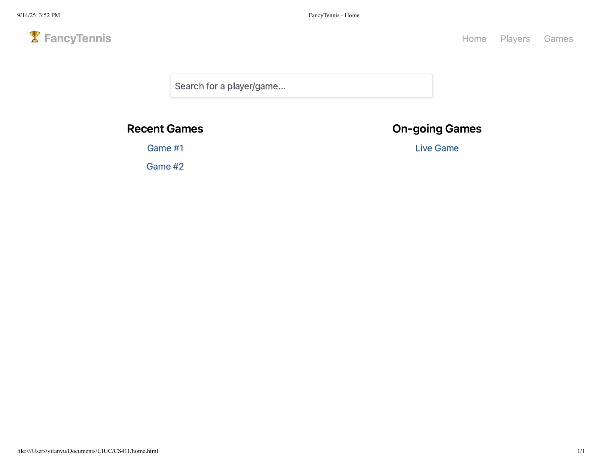
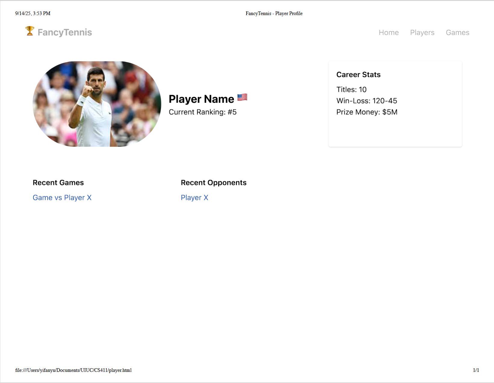
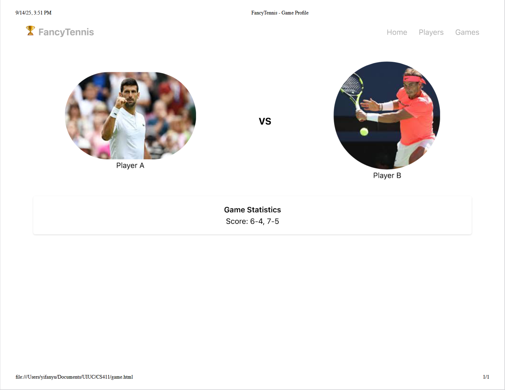
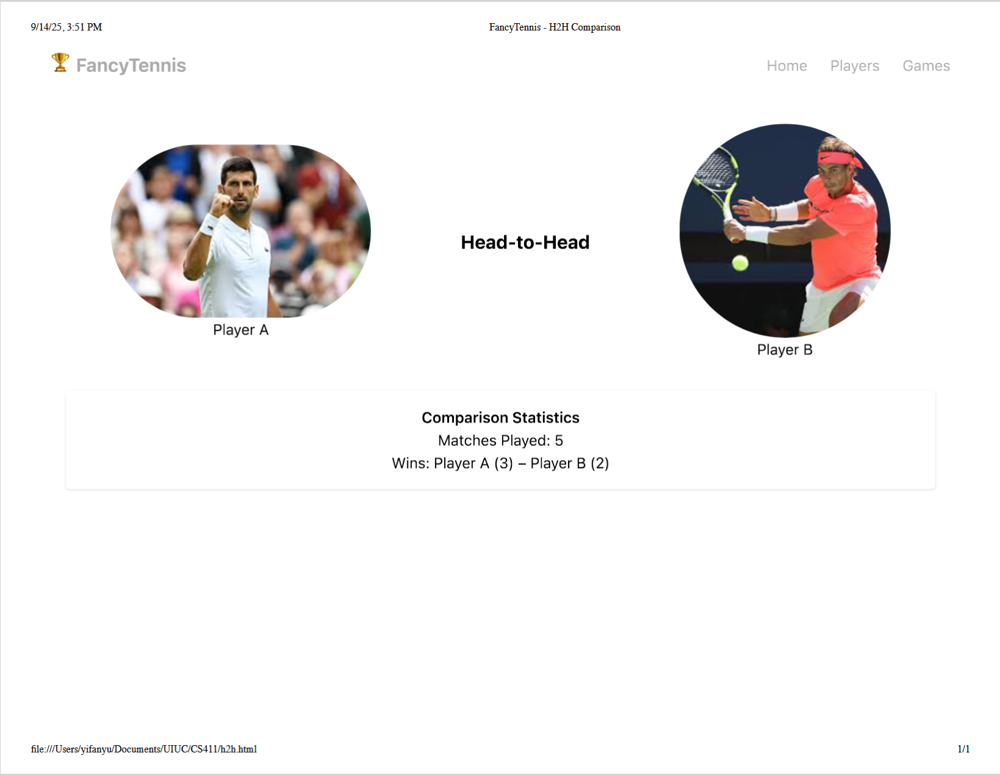

# MatchPoint Analytics: An Interactive Tennis Statistics Hub

## Project Summary
MatchPoint Analytics is a web app for tennis fans, fantasy players, and amateur analysts. Right now, tennis data is spread across many places: ATP/WTA sites for rankings, different databases for old matches, and news sites for updates. This makes it hard for fans to explore tennis in depth. Our project will put all this information into one simple and clear platform. Users will be able to view player careers, analyze head-to-head matchups, and see trends with charts. The goal is to make data more than just numbers, to tell stories about players and matches in an easy way.

## Description of Application
The problem we solve is that tennis data is not integrated. Fans can find rankings or results, but not in one place. Our app will have player profiles with bio, stats, titles, ranking history, and links to important matches. Users can also compare players directly with our head-to-head tool. They can filter by court surface, tournament type, or year to see detailed results. This way fans can go beyond simple win/loss and really understand matchups and player styles.

## Creative Component
The creative feature is an interactive head-to-head dashboard. When users choose two players, the backend will search all their matches and send results to the frontend. The frontend lets users apply filters in real time (like clay, grass, or Grand Slams). The dashboard will then update with visual charts:
* Bar charts for average aces, double faults, or break points won;
* Pie charts for win distribution on different surfaces;
* Timelines for ranking history and rivalry over years.

We also plan to add highlights like “biggest win” or “longest match” between the two players. This is technically hard because it requires fast backend queries and smooth frontend charts that can update live.

## Usefulness
The usefulness of our platform can be understood through its value to different user groups, its core functions, and its unique position compared to existing alternatives.

For casual tennis fans, the application serves as an engaging educational tool and a way to settle debates with friends. Instead of just knowing a player's win-loss record, a fan can visually explore how and where those wins occurred, creating a richer appreciation for the sport. For more serious users like fantasy sports players and bettors, MatchPoint Analytics provides a critical advantage. The ability to filter head-to-head data by court surface or tournament level allows them to make highly informed, data-driven decisions. Finally, for sports journalists and content creators, our platform is an invaluable research tool that drastically cuts down the time required to gather data for articles, videos, or podcasts, allowing them to focus on crafting compelling narratives.

## Basic and Complex Functions:

### Basic Functions (Simple Features): 
These are the foundational interactions that any user can perform easily.
* **Player Search:** Users can search for any professional tennis player by name.
* **View Player Profiles:** Users can access a dedicated page for each player showing their biographical data, career titles, prize money, and current rank.
* **View Match History:** Users can browse a chronological list of a player's past matches and results.
* **View Tournament Results:** Users can look up historical tournaments to see draws and match outcomes.

### Complex Features: 
These features represent the core analytical power of our application and involve significant data processing and interaction.
* **Interactive Head-to-Head (H2H) Showdown:** This is our most complex feature. Users can select any two players and see a detailed breakdown of their rivalry. They can then apply real-time filters for court surface, tournament level, and year to see how the matchup changes under different conditions, with all statistics and visualizations updating instantly.
* **Advanced Search & Discovery:** Users can perform complex queries that are impossible on other platforms, such as "Find all Grand Slam matches between two left-handed players that went to a fifth-set tiebreak."

## Comparison to Existing Applications:

### Similar Websites:
* ATP/WTA Tour Official Websites: The official governing bodies for professional tennis.
* Ultimate Tennis Statistics (UTS): A comprehensive database known for its raw statistical depth.
* General Sports Sites (e.g., ESPN, Flashscore): Provide live scores and basic statistics.

### How We Are Different: 
Our application is not just another data repository; it is an analytical tool focused on user experience and interactive visualization.
* The official ATP/WTA sites are cluttered with news and ticketing information, and their statistical tools are often slow and unintuitive. Our platform is fast, ad-free, and singularly focused on data exploration.
* Ultimate Tennis Statistics is powerful but presents its data almost exclusively in dense, static HTML tables. It is overwhelming for casual users and lacks any form of modern data visualization. Our platform turns these same numbers into interactive charts and graphs that are easy to understand.
* General sports sites offer surface-level data. They can tell you who won a match, but they cannot provide the deep, filterable H2H context that is the core of MatchPoint Analytics. Our application is built for depth and discovery, not just reporting scores.

## Realness
To build a robust and authentic application, MatchPoint Analytics will be powered by real, comprehensive, and publicly available datasets. We have identified two distinct and complementary data sources that will provide the historical depth and dynamic, up-to-date information necessary for a rich user experience. This two-source strategy ensures our database is both extensive and current.

### Data Source 1: Historical Match & Player Data
* **Source:** Jeff Sackmann's highly respected tennis data repositories on GitHub, specifically tennis_atp (for men's tennis) and tennis_wta (for women's tennis).
* **Format:** The data is provided in CSV (Comma-Separated Values) files, which are ideal for bulk import into a relational database like PostgreSQL or MySQL.
* **Data Size:** This dataset is incredibly comprehensive, ensuring we far exceed the project's data requirements.
    * **Cardinality (Rows):** The men's match data file (atp_matches_yyyy.csv series) contains over 180,000 unique match records from 1968 to the present day.
    * **Degree (Columns):** Each match record contains approximately 50 attributes.
* **Information Captured:** This source is the backbone of our historical analysis. It includes detailed, match-level statistics for every professional match, such as:
    * Tournament name, date, court surface, and round.
    * Winner and loser identification.
    * Match score.
    * Detailed in-match statistics (when available), including aces, double faults, serve percentages, break points saved/converted, and total points won.
    * Player details (name, nationality, hand preference).
    * Historical weekly player rankings.

### Data Source 2: Supplementary Dynamic Data API
* **Source:** TheSportsDB API. This is a free-to-use web API that provides crowd-sourced sports data.
* **Format:** The data is retrieved via standard HTTP GET requests, and the responses are formatted in JSON (JavaScript Object Notation). This format is lightweight and easily parsed by our backend server.
* **Information Captured:** This API elegantly fills the gaps left by the static CSV files, providing dynamic and descriptive content that enhances the user interface. We will primarily use it to fetch:
    * Player Images: High-quality photos of the players.
    * Biographical Information: Well-formatted player biographies and descriptions.
    * Upcoming Schedules: Information on future tournaments and matches.
    * Team & Country Logos: Graphics like country flags and logos for events like the Davis Cup.

By combining Jeff Sackmann's deep historical CSV data with the dynamic, rich media content from TheSportsDB API, we create a complete and realistic data foundation for MatchPoint Analytics. This dual-source approach allows us to offer both profound statistical depth and a polished, visually appealing user experience.

## Functionality
Our application provides comprehensive functionality for both general users and administrators: general users mainly perform Read/Search actions, while administrators have full CRUD capabilities.

### General Users (No login required)
* **Read/Search:** General users can perform the following actions without logging in:
    * Search for tennis players – find player profiles using keywords.
    * Search for tournaments and matches – browse historical and ongoing games.
    * View detailed statistics and head-to-head (H2H) comparisons – analyze match-level data and player rivalries.

To be specific, a user can type “Carlos Alcaraz” in the search bar and the system will display matching player information. Users can access the profile page to view details such as career titles, ranking history, height and other relevant information. Users can also select any match to see detailed statistics, including aces, first-serve points won and break points. In addition, users can use the H2H tool to compare two players and explore their historical matchups.

### Administrators (Login required)
* **Create:** Administrators can insert new records into the database (e.g., Player, Match)
* **Read/Search:** Administrators have the same searching  and viewing capabilities as general users.
* **Update:** Modify existing records such as updating a player’s profile or match results. 
* **Delete:** Remove incorrect or outdated records.

## Low-Fidelity UI Mockup
Here is the description of the UI we envisioned:

### Homepage:
* A clear, centered search bar with the prompt "Search for a player/game...".
* Below the search bar, sections for recent games and on-going games, where when user click it, user will be redirected to the specific game
* A clean navigation bar at the top: [Home] [Players] [Games]. When clicking on the players, top-3 recently searched players will be displayed. When clicking on the game, three recent games will be displayed.

### Player Profile Page:
* At the top left: Player's photo
* Next the player:  name, country flag, and current ranking.
* A summary box with key career stats: Titles, Win-Loss Record, Prize Money on the bottom right.
* Two lists will be in the bottom left:
    * One is the recent games. When clicked on a specific game, the user will be directed to that game
    * The other is the recent opponents: When clicked on an opponent, the user will be directed to the H2H comparison page of the two player

### Game Profile Page:
* On the two sides are the profile pictures of the two players.
* Statistics on the bottom to the two players in this game

### H2H Comparison Page (Creative Component):
* On the two sides are the profile pictures of the two players.
* Statistics on the bottom to the two players in this game.

## Project Work Distribution
Our team will be structured with primary responsibilities, but with a collaborative approach to ensure everyone contributes across the stack.

### Frontend (yifanyu4, lihengj2)：
* **Yifanyu4:** Responsible for UI design, including the overall layout, color scheme and interactive elements design. Also implements parts of the frontend code for key pages.
* **Lihengj2:** Responsible for implementing the remaining fronted pages and ensuring the interface functions correctly with user interactions.

### Backend (yifeiw16, yuhand7)：
* **Yifeiw16:** Responsible for data cleaning, database construction and implementation of backend APIs  to provide data to the frontend.
* **Yuhand7:** Completes the remaining backend code and integrates the frontend with the backend.